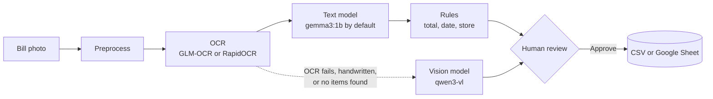
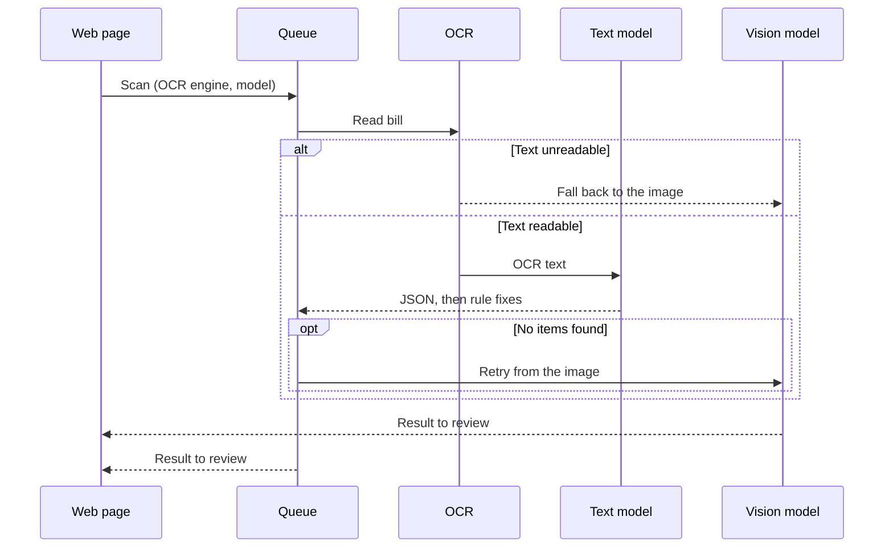

# Bill Scanner

Turn photos of bills and invoices into checked rows in a CSV file or Google Sheet. OCR and language models run locally through [Ollama](https://ollama.com), so bill data never leaves your machine and each scan costs nothing.

## How it works



Small models are unreliable at picking exact numbers, so the work is split. The model reads items, category and payment method. Deterministic rules own the total, date and store name, and override the model when they find a clear answer. Nothing is saved until a person approves it.

## Processing a bill



Bills are processed one at a time in upload order. Every step is written to a per-bill activity log shown in the page.

## Built with

| Layer | Technology |
| --- | --- |
| Backend | Python 3.11+, FastAPI, Pydantic, SQLite |
| OCR | GLM-OCR (via Ollama), RapidOCR (ONNX Runtime) |
| Language models | Any Ollama model. Default `gemma3:1b`. Vision fallback `qwen3-vl:4b-instruct` |
| Image handling | Pillow, pillow-heif (iPhone HEIC photos) |
| Output | CSV, or Google Sheets through gspread |
| Frontend | Single-page HTML, CSS and JavaScript, no build step |

## Features

- Choose the OCR engine and language model from the page, or type any Ollama model name
- Editable category list
- Structured JSON output enforced by a Pydantic schema
- Automatic checks: items versus total, missing date, unreadable OCR
- Editable review screen with the original photo beside the extracted fields

## Quick start

```bash
ollama pull gemma3:1b
ollama pull glm-ocr
ollama pull qwen3-vl:4b-instruct
./run.sh
```

Open `http://127.0.0.1:8000`.

## Configuration

| Variable | Default | Purpose |
| --- | --- | --- |
| `TEXT_MODEL` | `gemma3:1b` | Default language model |
| `VISION_MODEL` | `qwen3-vl:4b-instruct` | Fallback vision model |
| `OCR_ENGINE` | `glm` | Default engine, `glm` or `rapid` |
| `SYNC_TARGET` | `csv` | `csv` or `sheet` |
| `SHEET_NAME`, `GOOGLE_CREDS` | `Bills`, `creds.json` | Google Sheets target and service account |
| `USE_RULES` | `1` | Set `0` to use raw model output |

For Google Sheets, install the extra with `uv sync --extra sheets` and create `Bills` and `Items` tabs.

## Evaluation

The pipeline is scored on the [SROIE](https://huggingface.co/datasets/jsdnrs/ICDAR2019-SROIE) receipt dataset for company, date and total accuracy. A second script attributes each error to OCR, the rules, or the label.

```bash
uv run --extra eval python -m evaluation.eval_sroie --n 100 --ocr glm --model gemma3:1b
uv run --extra eval python -m evaluation.verify --out output/eval_out --split test
```
